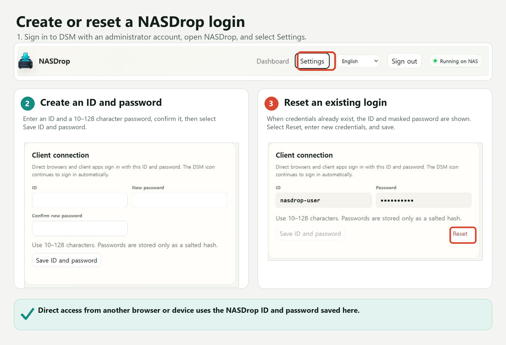
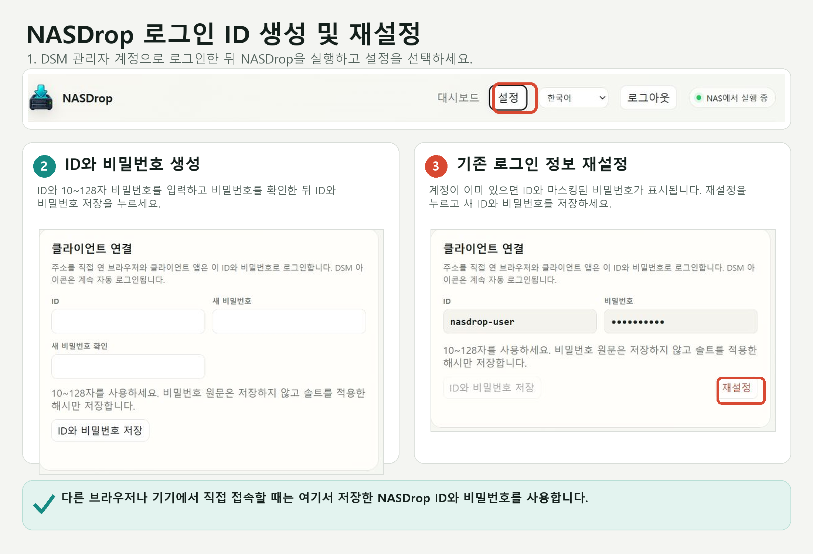
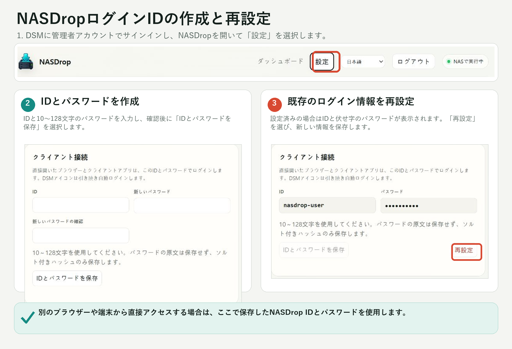
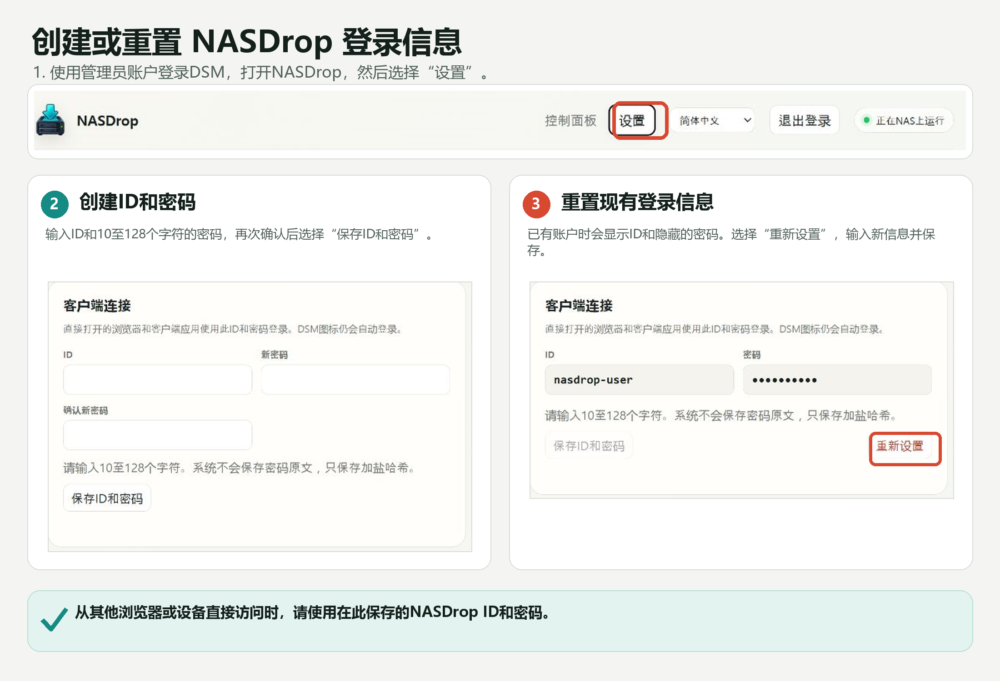
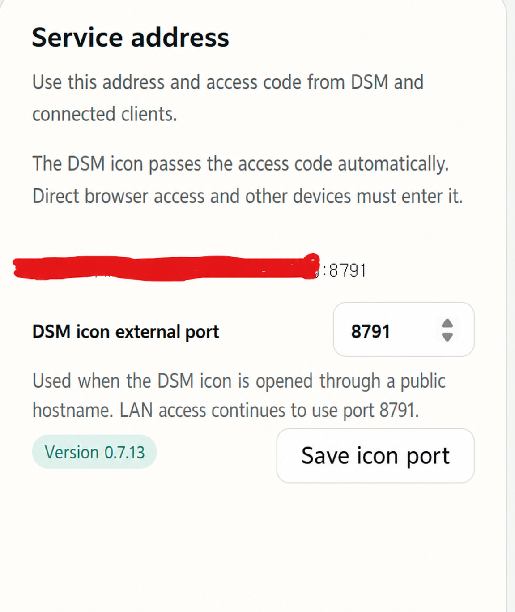
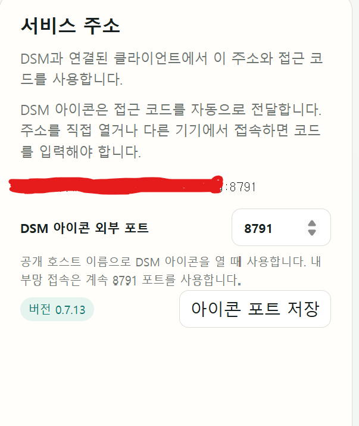
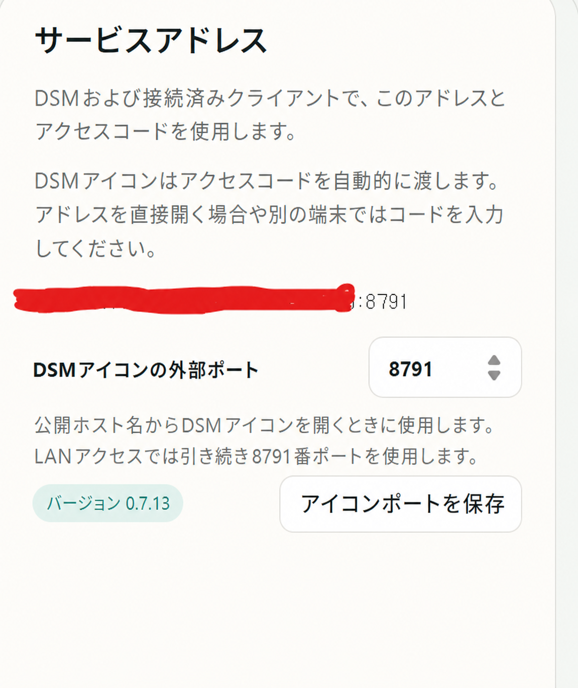
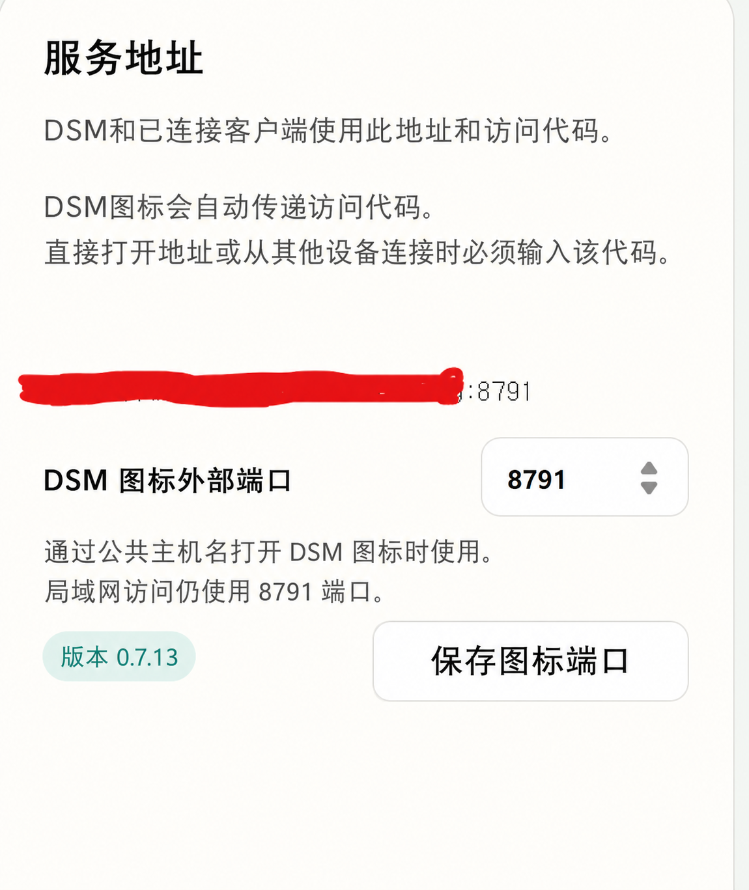

# NASDrop

[](#install-a-prebuilt-release)

> [!TIP]
> **DSM 7.1 support is now available.** NASDrop has been verified on real DSM 7.1 and DSM 7.2 hardware. The current SPK supports Intel/AMD 64-bit (`x86_64`) Synology NAS models running DSM 7.1 or later.

NASDrop is a self-hosted personal download portal for Synology DSM and Docker hosts. Paste a supported GigaFile, GoFile, Pixeldrain, or Buzzheavier signed direct link, and the storage server downloads the file directly.

**[Download the latest SPK release](https://github.com/littleweirdlab0514-web/NASDROP/releases/latest)**

> [!IMPORTANT]
> NASDrop is an independent, unofficial community project. It is not listed in Synology's official Package Center catalog and must be installed manually. It is not affiliated with, endorsed by, or sponsored by Synology, GigaFile, GoFile, Pixeldrain, or Buzzheavier.

> [!WARNING]
> **Third-party service changes may break NASDrop.** NASDrop depends on the websites and APIs operated by GigaFile, GoFile, Pixeldrain, and Buzzheavier. Those providers may change their policies, terms, authentication, URL formats, rate limits, APIs, or download mechanisms without notice. Such changes may cause some or all NASDrop download functions to stop working temporarily or permanently. Continued compatibility and uninterrupted availability are not guaranteed.

## What's new in 0.9.4

- Buzzheavier signed direct links copied with **Copy download link** are now accepted by the web portal and Android client.
- Buzzheavier link tokens are removed from the public job source and stored separately with restricted permissions so they do not appear in the job list or `jobs.json`.
- Expired Buzzheavier links now produce a provider-specific message asking for a newly copied link.
- The settings screen now combines parallel-download and per-file transfer controls into one compact half-width card with a single warning and save action.

## What's new in 0.9.3

- Downloads, segmented-file assembly, verification, and extraction now run inside a hidden `.nasdrop-tmp` workspace. Only the completed file or extracted folder is moved to the selected destination.
- ZIP (including AES-encrypted ZIP), 7z, RAR, and TAR-family archives can be extracted automatically. Extraction can be selected for each job, and an archive password can be entered when adding a job or after NASDrop detects that one is required.
- Disk protection can pause new downloads while verification or extraction is using the disk heavily.
- GigaFile filenames are resolved from the real download metadata so the queue can show the final filename before completion whenever the provider supplies it.
- The DSM launcher is validated during packaging so its desktop label remains `NASDrop`.

> [!NOTE]
> **ALZip EGG archives are not supported for extraction.** If an `.egg` file is downloaded, NASDrop saves it in its original `.egg` form even when extraction was requested. Extract it later with a separate EGG-compatible application.

## Features

- Validates GigaFile, GoFile, Pixeldrain, and Buzzheavier signed direct links and displays file names and sizes
- Queues multiple download jobs
- Supports a per-job destination folder and a configurable default folder
- Offers either an 8-part verified download or a lower-disk-I/O single-connection download
- Keeps partial files and assembly work inside a hidden `.nasdrop-tmp` workspace, then publishes only complete results
- Can extract ZIP (including AES), 7z, RAR, and TAR-family archives with an optional per-job password
- Pauses new downloads during verification and extraction when disk protection is enabled
- Displays progress, failure details, and SHA-256 results
- Supports pausing, resuming, and deleting jobs, plus clearing completed jobs in bulk
- Protects direct browser and client-app access with an ID, hashed password, login throttling, and time-limited sessions
- Detects GoFile rate limits and uses a persistent cooldown circuit breaker
- Runs as either a native Synology SPK or a multi-platform Docker container on amd64 and arm64 hosts

### Download method option

The default **8-part download + verification** mode downloads eight byte ranges in parallel, combines them locally, checks the final size, tests ZIP archives, and calculates SHA-256. It provides stronger integrity checking but can require substantial disk I/O after a large download finishes.

The optional **Single connection** mode writes one resumable temporary file without splitting or merging it. The shared post-processing pipeline still checks the final size and SHA-256 and performs archive validation when applicable. This lowers connection pressure while preserving integrity checks. The selected mode applies to new and resumed jobs.

## Repository layout

- `backend.py`: Authentication, link inspection, and the storage-local download queue
- `gofile_wt.mjs`: Helper for generating GoFile web tokens
- `synology/`: DSM SPK metadata, web UI, lifecycle scripts, and build tools
- `Dockerfile`, `compose.yaml`, and `docker/`: Portable container image, Compose example, and startup/account utilities
- `config.example.json`: Example package configuration
- `runtime/`: Hashed account credentials, sessions, configuration, logs, and job state; excluded from Git

## Install a prebuilt release

1. Open the [latest GitHub release](https://github.com/littleweirdlab0514-web/NASDROP/releases/latest) and download the `x86_64.spk` asset.
2. In DSM, open **Package Center > Manual Install**.
3. Select the downloaded SPK and review the manual-install warning and license.
4. Complete the installation, then grant the NASDrop package account access to a destination folder as described below.

The package supports DSM 7.1 or later on Intel/AMD 64-bit (`x86_64`) Synology NAS models. DSM 7.1 and DSM 7.2 have both been verified on real hardware. ARM models are not supported yet. Because this is not an official Package Center listing, GitHub releases are the only supported distribution channel and updates are installed manually.

NASDrop does not select a default download folder during installation. A download cannot start until a writable destination is selected either as the default destination or for that individual job.

> [!IMPORTANT]
> **After every update, open NASDrop Settings and select the default download folder again before adding new jobs.** Even if the previous path still appears, reselect it once so NASDrop can confirm that the package account still has write permission.

When upgrading from an older release, the former automatically assigned `/volume2/downloads` value is cleared. A different destination that was explicitly selected by the administrator may remain visible, but it should still be selected again after the update as described above.

## Run with Docker

The Docker image is suitable for Synology Container Manager, ordinary Linux servers, home servers, and Docker Desktop. Published images target both `linux/amd64` and `linux/arm64`.

### Docker Compose quick start

1. Download `compose.yaml` and copy `docker/compose.env.example` to `.env`.
2. Edit `.env` and set `NASDROP_CONFIG_DIR` and `NASDROP_DOWNLOAD_DIR` to persistent host folders.
3. On Linux or Synology, set `PUID` and `PGID` to the numeric user and group that can write to the download folder. You can find them with `id your-user`.
4. Create the first NASDrop account interactively. The password is prompted without being placed in the command line or Compose environment:

   ```sh
   docker compose run --rm nasdrop account set owner
   ```

5. Start NASDrop and open `http://SERVER-IP:8791`:

   ```sh
   docker compose up -d
   ```

6. Sign in, open **Settings**, and select the default download folder once so NASDrop verifies write access.

The default Compose configuration persists application state in `./nasdrop-config`, mounts `./downloads` as `/downloads`, and stores partial files in `/downloads/.nasdrop-tmp`. Recreating or updating the container does not remove those host folders.

To reset the login later, run the account command against the running container and restart it:

```sh
docker compose exec nasdrop nasdrop-account set owner
docker compose restart nasdrop
```

### Additional storage folders

Containers can only browse host folders explicitly mounted into them. To expose more destinations, add each bind mount and list every container path in `NAS_PORTAL_STORAGE_ROOTS`:

```yaml
services:
  nasdrop:
    environment:
      NAS_PORTAL_NAS_TARGET: /downloads
      NAS_PORTAL_STORAGE_ROOTS: /downloads,/media,/archive
    volumes:
      - /srv/downloads:/downloads
      - /srv/media:/media
      - /mnt/archive:/archive
```

NASDrop never recursively changes permissions on mounted download folders. If the container reports that a folder is not writable, adjust the host folder for the configured `PUID:PGID`; do not run the service as a privileged container. Only `/config` is automatically assigned to that numeric account.

### Docker update and HTTPS

Update without deleting persistent data:

```sh
docker compose pull
docker compose up -d
```

After an update, open **Settings** and select the default download folder again. For access outside the local network, place NASDrop behind an HTTPS reverse proxy and do not expose plain HTTP port `8791` directly to the internet.

## Opening NASDrop and setting up client login

- Sign in to DSM with an administrator account, then open NASDrop from its DSM desktop or Package Center icon. This administrator-only launch signs in automatically.
- After installing or updating, use that DSM administrator launch and create a NASDrop ID and password under **Settings > Client connection**.
- Opening the service address directly, using another browser, or connecting a client app requires that ID and password.
- If the ID or password is forgotten, sign in to DSM, open NASDrop from its DSM icon, and reset both values under **Settings > Client connection**. The old password cannot be displayed or recovered.
- Passwords are stored only as salted PBKDF2-SHA256 hashes. Successful logins receive a time-limited session token; changing the account credentials revokes existing sessions.
- Five consecutive failed login attempts from the same client IP trigger a 15-minute login block.

The DSM launcher uses a separate internal browser handoff value and removes it from the address immediately. It is not displayed in the NASDrop interface or stored as a reusable client credential.

### Client login creation and reset examples

The following guides show how a DSM administrator creates the first NASDrop ID and password, and how the same administrator-only DSM launch can reset existing credentials.

<details open>
<summary><strong>English</strong></summary>



</details>

<details>
<summary><strong>한국어 (Korean)</strong></summary>



</details>

<details>
<summary><strong>日本語 (Japanese)</strong></summary>



</details>

<details>
<summary><strong>简体中文 (Simplified Chinese)</strong></summary>



</details>

## Build from source

Build the SPK with Windows PowerShell and Python 3.11 or later. The build tool packages DSM shell scripts with LF line endings and executable permissions, then validates the resulting archive.

```powershell
.\synology\build-spk.ps1
```

The output is `synology/dist/nasdrop-0.9.4-4-x86_64.spk`. Building from source does not make the package an official Synology Package Center application.

Release validation details are in [docs/RELEASE_CHECKLIST.md](docs/RELEASE_CHECKLIST.md). Provider filename handling and DSM launcher-title rules are documented in [docs/PROVIDER_FILENAME_GUIDE.md](docs/PROVIDER_FILENAME_GUIDE.md) and [docs/DSM_LAUNCHER_GUIDE.md](docs/DSM_LAUNCHER_GUIDE.md) so those regressions are checked before future releases.

## Configuring a download folder

1. In DSM, open **Control Panel > Shared Folder**.
2. Create a shared folder or select an existing one, then click **Edit > Permissions**.
3. Change the permission category to **System internal user**.
4. Find the NASDrop package account, commonly displayed as `sc-nasdownloadportal`, and grant it **Read/Write** permission.
5. Open NASDrop, go to **Settings > Default destination > Change**, and select the writable shared folder.

Folders without package-account permission appear locked or cannot be selected. If an encrypted shared folder is used, mount it before starting NASDrop. You can also leave the default empty and choose a writable destination separately for each download job.

See Synology's official guides for [creating a shared folder](https://kb.synology.com/en-global/DSM/help/DSM/AdminCenter/file_share_create?version=7) and [assigning shared-folder permissions](https://kb.synology.com/en-global/DSM/help/DSM/AdminCenter/file_share_privilege?version=7).

## Languages

English is the default interface language. NASDrop automatically follows the browser language when it is Korean, Japanese, or Chinese. It falls back to English when the language is unsupported or cannot be detected.

Users can manually select English, Korean, Japanese, or Chinese on the login screen or from the top navigation. The selection is stored in the browser. DSM Package Center descriptions support the same four languages.

## Configuring HTTPS with DSM Reverse Proxy

NASDrop listens on plain HTTP port `8791` inside the NAS. For internet access, keep that application port private and terminate HTTPS with DSM's built-in reverse proxy.

1. Open **Control Panel > Login Portal > Advanced > Reverse Proxy** and click **Create**.
2. Configure the source:
   - Protocol: `HTTPS`
   - Hostname: your public hostname, such as `nas.example.com`
   - Port: `8443`
3. Configure the destination:
   - Protocol: `HTTP`
   - Hostname: `127.0.0.1`
   - Port: `8791`
4. Save the rule.
5. Open **Control Panel > Security > Certificate > Settings** and assign a valid certificate for the public hostname to the new reverse-proxy service.

### Real-world example from the maintainer's environment

The screenshots below show the configuration currently used in the maintainer's own environment. They are provided as a working reference, not as values that must be copied exactly. Replace the hostname and NAS IP address with the values for your own network.

In this environment, the router forwards external port `8791` to port `8443` on the NAS at `192.168.1.157`. The router is set to `BOTH`; TCP alone is sufficient for NASDrop.

The DSM reverse-proxy rule receives HTTPS on port `8443` and forwards it to the NASDrop HTTP service at `192.168.1.157:8791`.

Select a language to view both configuration screens. The localized copies are visual translations of the same settings; menu wording may differ slightly depending on the router firmware and DSM version.

<details open>
<summary><strong>English</strong></summary>


</details>

<details>
<summary><strong>한국어 (Korean)</strong></summary>


</details>

<details>
<summary><strong>日本語 (Japanese)</strong></summary>


</details>

<details>
<summary><strong>简体中文 (Simplified Chinese)</strong></summary>


</details>

The actual source hostname has been hidden in the screenshot. Enter your own certificate hostname in that field. A matching wildcard certificate, such as `*.example.com`, can be assigned to the rule. For the destination hostname, either `127.0.0.1` (recommended) or your NAS LAN address can be used.

If the public address must remain `https://nas.example.com:8791`, configure the router to forward external TCP `8791` to NAS TCP `8443`. The complete request path is:

```text
Internet HTTPS :8791 -> router -> NAS HTTPS :8443 -> DSM Reverse Proxy -> HTTP 127.0.0.1:8791
```

If the router uses a different external port, such as `8795`, open **NASDrop > Settings > Service address** and set **DSM icon external port** to the same value. The DSM icon will then open `https://your-public-hostname:8795`, while private LAN launches continue to use the internal NASDrop port `8791`.

### DSM icon external port setting

The following screenshots show the new port setting in all four supported interface languages. The public hostname is intentionally hidden.

<details open>
<summary><strong>English</strong></summary>



</details>

<details>
<summary><strong>한국어 (Korean)</strong></summary>



</details>

<details>
<summary><strong>日本語 (Japanese)</strong></summary>



</details>

<details>
<summary><strong>简体中文 (Simplified Chinese)</strong></summary>



</details>

Do not forward any external port directly to NAS port `8791`; that would expose login credentials and portal traffic over unencrypted HTTP.

DSM should forward the original host and HTTPS scheme. If the generated public address is incorrect, add or correct these reverse-proxy request headers:

- `X-Forwarded-Proto: https`
- `X-Forwarded-Host: nas.example.com:8791` when the public URL uses port `8791`

After saving the configuration, test the exact HTTPS address from outside the local network. A request beginning with `http://` will return `400 Bad Request` because plain HTTP was sent to an HTTPS listener.

The DSM launcher uses HTTP with port `8791` for private LAN IP addresses and local hostnames. For public hostnames it uses HTTPS with the external icon port selected in NASDrop settings. See Synology's official [DSM Reverse Proxy documentation](https://kb.synology.com/en-global/DSM/help/DSM/AdminCenter/system_login_portal_advanced?version=7).

## Verification

```powershell
python -m py_compile backend.py
python -m unittest discover -s tests -p "test_*.py"
node --test tests/rendered-html.test.mjs tests/gofile-wt-sandbox.test.mjs
```

## Security guidelines

- Keep runtime credentials and device-specific configuration private.
- Never commit `runtime/`, `.env*`, signing keys, or device-specific secrets.
- The local `service.log` records timestamps, client IP addresses, HTTP methods, endpoint paths without query strings, and response status codes for diagnostics. Each log file is limited to 1 MiB and only two rotated backups are retained (about 3 MiB maximum total).
- Use HTTPS whenever the portal is accessible from the internet.
- Consider an additional access-control layer beyond the NASDrop account login for internet-facing deployments.
- NASDrop does not require DSM administrator passwords or NAS account credentials in the web interface.
- Only submit links and download files that you own or are authorized to access. You are responsible for complying with the source service's terms and applicable law.

## Supported links and rate-limit protection

NASDrop currently supports standard GigaFile links, GoFile share links, Pixeldrain file-share links, and Buzzheavier signed direct links copied from the provider page. For Pixeldrain, it compares the SHA-256 value reported by the public API with the final downloaded file hash.

### Buzzheavier signed direct links

A normal Buzzheavier share URL such as `https://buzzheavier.com/FILE_ID` opens the provider page; it is not the direct file URL that NASDrop needs. Use the following steps:

1. Open the normal `https://buzzheavier.com/FILE_ID` share page in a regular browser.
2. On the real Buzzheavier file page, select **Copy download link**. Do not copy an advertisement button or the browser address bar URL again.
3. Confirm that the copied address begins with HTTPS, uses a Buzzheavier download host, contains `/d/FILE_ID`, and still includes its complete `?v=...` query value.
4. Paste that copied address into the NASDrop web portal or Android app. You may then choose a destination folder and extraction option normally.
5. Add the job promptly. NASDrop inspects the signed link and the NAS downloads the file directly; the browser or phone does not relay the file data.

The address accepted by NASDrop has a form similar to:

```text
https://DOWNLOAD-SERVER.buzzheavier.com/d/FILE_ID?v=SIGNED_TOKEN
```

For example, submit the copied `https://ts.buzzheavier.com/d/...?...` style address—not the original `https://buzzheavier.com/...` page address. Do not remove or shorten the query string: the complete `v` value is required to authorize the file request.

Verified Buzzheavier responses provide the final filename through `Content-Disposition`, the file size through `Content-Length`, and byte-range support for segmented downloads and resume.

The `v` value is a signed, potentially time-limited token. If NASDrop reports that the link has expired, is unauthorized, or no longer resolves to a file, return to the original share page, select **Copy download link** again, and submit the newly generated address. Repeatedly retrying the expired address will not refresh it.

> [!CAUTION]
> Treat the complete copied URL as private while it remains valid. Do not post it in public issues, screenshots, chat logs, or documentation. When reporting a problem, remove the entire query string or replace the token with `?v=REDACTED`. Keep the original share-page address so you can generate a fresh signed link later.

NASDrop does not automate Buzzheavier's advertisement page or imitate clicks on the provider page. The user obtains the final link in a normal browser, while the NAS performs only the resulting direct file transfer. Only download files that you own or are authorized to access.

When GoFile returns HTTP 429, NASDrop immediately blocks additional GoFile requests and stores the cooldown deadline in persistent state. The cooldown survives service restarts, preventing repeated retries from making an IP restriction worse. Link-inspection logic may require updates when an external service changes its website or API behavior.

### Warning: excessive requests can cause access restrictions

External download services may rate-limit or block the NAS public IP when they receive too many link inspections, download attempts, parallel connections, or rapid retries. This can result in HTTP 429 responses, temporary access restrictions, or a longer IP-based block. NASDrop cannot remove a restriction imposed by an external service.

To reduce the risk:

- Keep parallel downloads from the same service disabled unless they are necessary.
- Do not repeatedly submit the same link or restart NASDrop to bypass a displayed cooldown.
- When NASDrop reports a protection pause, wait until the displayed cooldown has fully expired.
- Avoid testing the same external service simultaneously from multiple tools or devices on the same public IP.
- If access is already restricted, stop all automated requests and allow sufficient time for the external service to release the restriction.

NASDrop processes jobs from the same provider sequentially by default and preserves GoFile cooldown state across service restarts. These protections reduce request volume, but they cannot guarantee that an external service will not apply its own limits.

## Support and reporting issues

- For installation problems, provider compatibility, and other non-security bugs, open a [GitHub issue](https://github.com/littleweirdlab0514-web/NASDROP/issues).
- For vulnerabilities or reports containing sensitive details, follow [SECURITY.md](SECURITY.md) and do not open a public issue.
- Include the NAS model, DSM version, NASDrop version, relevant logs with account credentials, session tokens, and private URLs removed, and clear reproduction steps.

External services may change without notice. Compatibility fixes are provided on a best-effort basis, and this unofficial package has no support relationship with Synology or the supported download services.

## License

NASDrop is released under the [MIT License](LICENSE). Bundled third-party components retain their own licenses; see [THIRD_PARTY_NOTICES.md](THIRD_PARTY_NOTICES.md).
