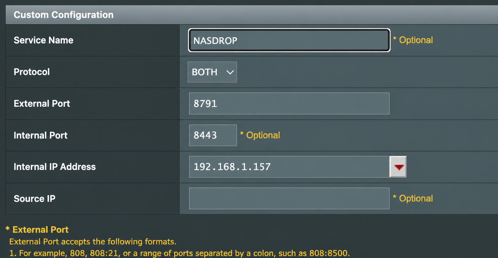
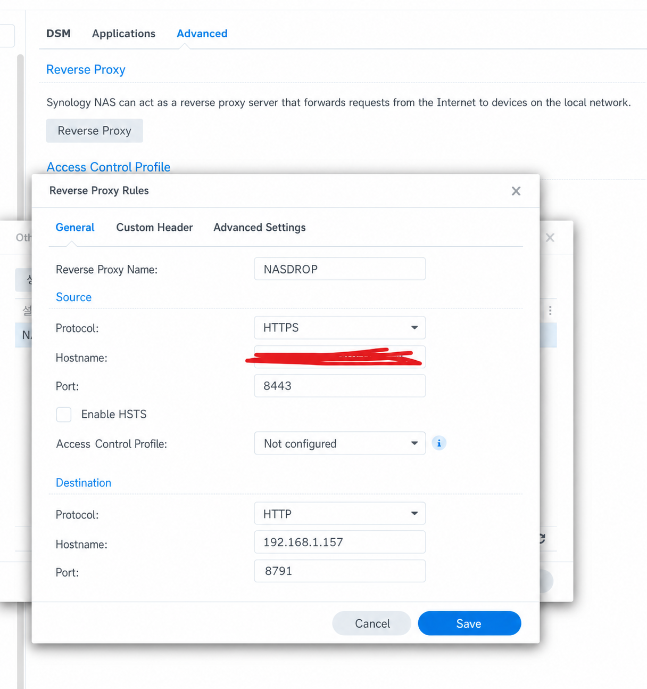
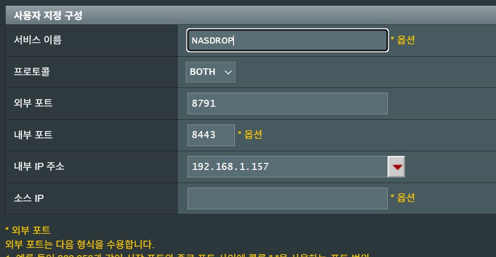
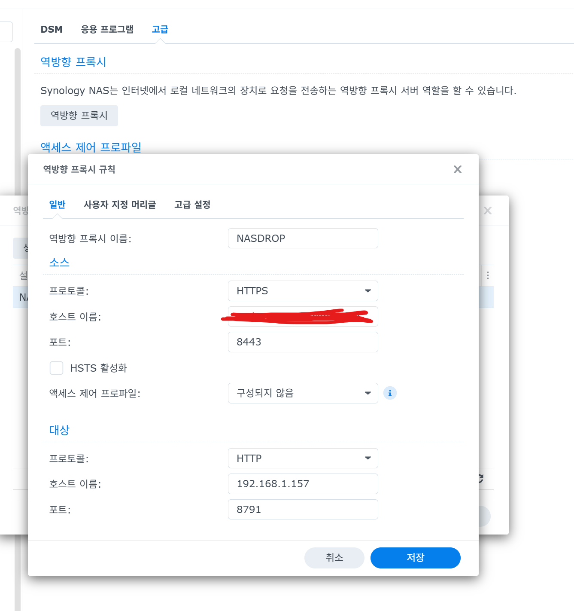
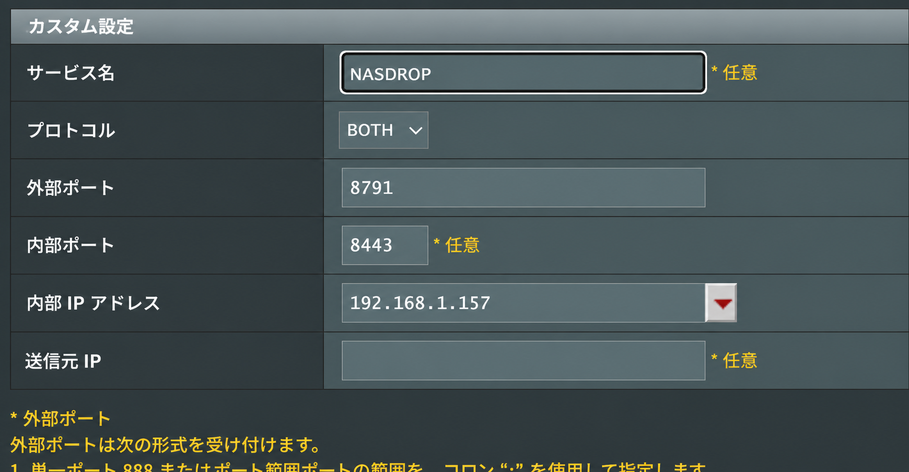
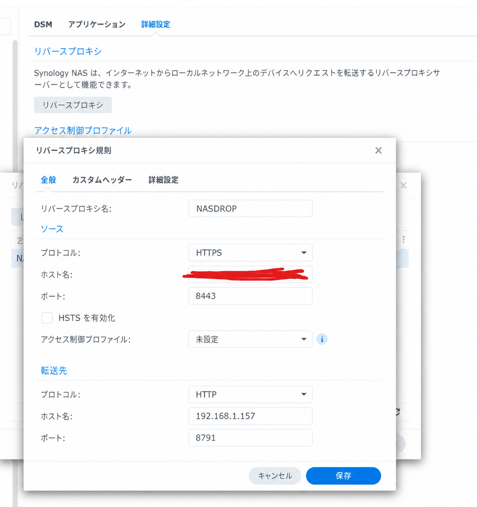
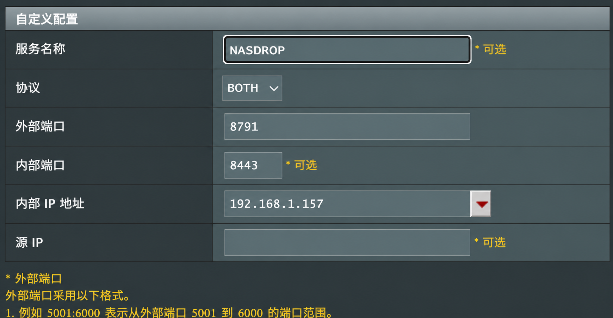
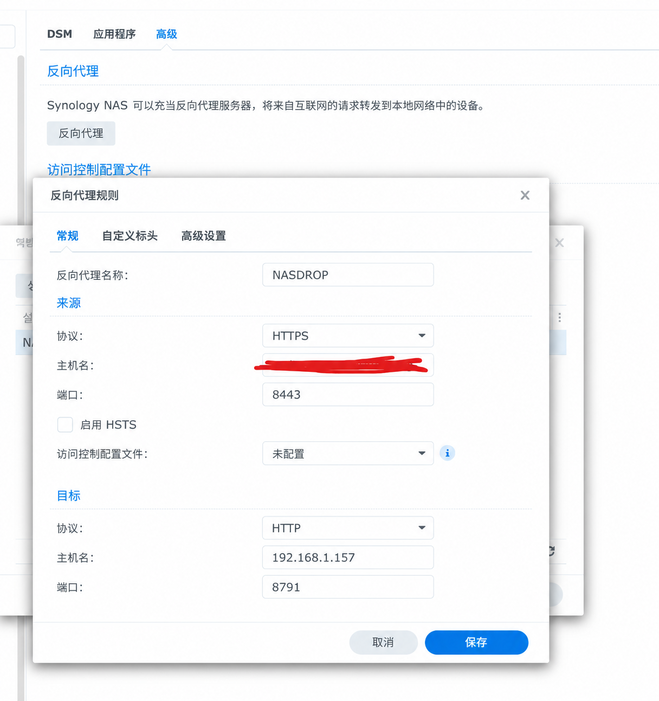

# NASDrop

NASDrop is a self-hosted personal download portal for Synology DSM. Paste a supported GigaFile, GoFile, or Pixeldrain share link, and the Synology NAS downloads the file directly.

**[Download the latest SPK release](https://github.com/littleweirdlab0514-web/NASDROP/releases/latest)**

> [!IMPORTANT]
> NASDrop is an independent, unofficial community project. It is not listed in Synology's official Package Center catalog and must be installed manually. It is not affiliated with, endorsed by, or sponsored by Synology, GigaFile, GoFile, or Pixeldrain.

## Features

- Validates GigaFile, GoFile, and Pixeldrain links and displays file names and sizes
- Queues multiple download jobs
- Supports a per-job destination folder and a configurable default folder
- Downloads file parts directly on the Synology NAS and combines them locally
- Displays progress, failure details, and SHA-256 results
- Supports pausing, resuming, and deleting jobs, plus clearing completed jobs in bulk
- Protects the private web interface with an access code
- Detects GoFile rate limits and uses a persistent cooldown circuit breaker

## Repository layout

- `backend.py`: Authentication, link inspection, and the NAS-local download queue
- `gofile_wt.mjs`: Helper for generating GoFile web tokens
- `synology/`: DSM SPK metadata, web UI, lifecycle scripts, and build tools
- `config.example.json`: Example package configuration
- `runtime/`: Access codes, configuration, logs, and job state; excluded from Git

## Install a prebuilt release

1. Open the [latest GitHub release](https://github.com/littleweirdlab0514-web/NASDROP/releases/latest) and download the `x86_64.spk` asset.
2. In DSM, open **Package Center > Manual Install**.
3. Select the downloaded SPK and review the manual-install warning and license.
4. Complete the installation, then grant the NASDrop package account access to a destination folder as described below.

The package supports DSM 7.2 or later on Intel/AMD 64-bit (`x86_64`) Synology NAS models. ARM models are not supported yet. Because this is not an official Package Center listing, GitHub releases are the only supported distribution channel and updates are installed manually.

NASDrop does not select a default download folder during installation. A download cannot start until a writable destination is selected either as the default destination or for that individual job.

When upgrading from an older release, the former automatically assigned `/volume2/downloads` value is cleared. A different destination that was explicitly selected by the administrator is preserved.

## Opening NASDrop and using the access code

- Opening NASDrop from its DSM desktop or Package Center icon automatically passes the current NASDrop access code and opens the dashboard.
- Opening the service address directly in a browser, or connecting from another device, does not receive that automatic code. Enter the access code shown in **NASDrop > Settings > Client connection**.
- Regenerating the access code disconnects browsers and clients that saved the previous code. Launching NASDrop again from DSM passes the newly generated code.

The DSM launcher transfers the code in the URL fragment and NASDrop removes that fragment from the browser address after saving it locally. Do not share screenshots or copied launcher URLs that still contain `#token=`.

## Build from source

Build the SPK with Windows PowerShell and Python 3.11 or later. The build tool packages DSM shell scripts with LF line endings and executable permissions, then validates the resulting archive.

```powershell
.\synology\build-spk.ps1
```

The output is `synology/dist/nasdrop-0.7.11-1-x86_64.spk`. Building from source does not make the package an official Synology Package Center application.

## Configuring a download folder

1. In DSM, open **Control Panel > Shared Folder**.
2. Create a shared folder or select an existing one, then click **Edit > Permissions**.
3. Change the permission category to **System internal user**.
4. Find the NASDrop package account, commonly displayed as `sc-nasdownloadportal`, and grant it **Read/Write** permission.
5. Open NASDrop, go to **Settings > Default destination > Change**, and select the writable shared folder.

Folders without package-account permission appear locked or cannot be selected. If an encrypted shared folder is used, mount it before starting NASDrop. You can also leave the default empty and choose a writable destination separately for each download job.

See Synology's official guides for [creating a shared folder](https://kb.synology.com/en-global/DSM/help/DSM/AdminCenter/file_share_create?version=7) and [assigning shared-folder permissions](https://kb.synology.com/en-global/DSM/help/DSM/AdminCenter/file_share_privilege?version=7).

## Languages

English is the default interface language. NASDrop automatically follows the browser language when it is Korean, Japanese, or Chinese. It falls back to English when the language is unsupported or cannot be detected.

Users can manually select English, Korean, Japanese, or Chinese on the login screen or from the top navigation. The selection is stored in the browser. DSM Package Center descriptions support the same four languages.

## Configuring HTTPS with DSM Reverse Proxy

NASDrop listens on plain HTTP port `8791` inside the NAS. For internet access, keep that application port private and terminate HTTPS with DSM's built-in reverse proxy.

1. Open **Control Panel > Login Portal > Advanced > Reverse Proxy** and click **Create**.
2. Configure the source:
   - Protocol: `HTTPS`
   - Hostname: your public hostname, such as `nas.example.com`
   - Port: `8443`
3. Configure the destination:
   - Protocol: `HTTP`
   - Hostname: `127.0.0.1`
   - Port: `8791`
4. Save the rule.
5. Open **Control Panel > Security > Certificate > Settings** and assign a valid certificate for the public hostname to the new reverse-proxy service.

### Real-world example from the maintainer's environment

The screenshots below show the configuration currently used in the maintainer's own environment. They are provided as a working reference, not as values that must be copied exactly. Replace the hostname and NAS IP address with the values for your own network.

In this environment, the router forwards external port `8791` to port `8443` on the NAS at `192.168.1.157`. The router is set to `BOTH`; TCP alone is sufficient for NASDrop.

The DSM reverse-proxy rule receives HTTPS on port `8443` and forwards it to the NASDrop HTTP service at `192.168.1.157:8791`.

Select a language to view both configuration screens. The localized copies are visual translations of the same settings; menu wording may differ slightly depending on the router firmware and DSM version.

<details open>
<summary><strong>English</strong></summary>





</details>

<details>
<summary><strong>한국어 (Korean)</strong></summary>





</details>

<details>
<summary><strong>日本語 (Japanese)</strong></summary>





</details>

<details>
<summary><strong>简体中文 (Simplified Chinese)</strong></summary>





</details>

The actual source hostname has been hidden in the screenshot. Enter your own certificate hostname in that field. A matching wildcard certificate, such as `*.example.com`, can be assigned to the rule. For the destination hostname, either `127.0.0.1` (recommended) or your NAS LAN address can be used.

If the public address must remain `https://nas.example.com:8791`, configure the router to forward external TCP `8791` to NAS TCP `8443`. The complete request path is:

```text
Internet HTTPS :8791 -> router -> NAS HTTPS :8443 -> DSM Reverse Proxy -> HTTP 127.0.0.1:8791
```

Do not forward external port `8791` directly to NAS port `8791`; that would expose the access code and portal traffic over unencrypted HTTP.

DSM should forward the original host and HTTPS scheme. If the generated public address is incorrect, add or correct these reverse-proxy request headers:

- `X-Forwarded-Proto: https`
- `X-Forwarded-Host: nas.example.com:8791` when the public URL uses port `8791`

After saving the configuration, test the exact HTTPS address from outside the local network. A request beginning with `http://` will return `400 Bad Request` because plain HTTP was sent to an HTTPS listener.

The DSM launcher uses HTTP for private LAN IP addresses and local hostnames, and HTTPS for public hostnames. See Synology's official [DSM Reverse Proxy documentation](https://kb.synology.com/en-global/DSM/help/DSM/AdminCenter/system_login_portal_advanced?version=7).

## Verification

```powershell
python -m py_compile backend.py
python -m unittest discover -s tests -p "test_*.py"
node --test tests/rendered-html.test.mjs tests/gofile-wt-sandbox.test.mjs
```

## Security guidelines

- Keep runtime credentials and device-specific configuration private.
- Never commit `runtime/`, `.env*`, signing keys, or device-specific secrets.
- The local `service.log` records timestamps, client IP addresses, HTTP methods, endpoint paths without query strings, and response status codes for diagnostics. Each log file is limited to 1 MiB and only two rotated backups are retained (about 3 MiB maximum total).
- Use HTTPS whenever the portal is accessible from the internet.
- Consider an additional access-control layer beyond the NASDrop access code for internet-facing deployments.
- NASDrop does not require DSM administrator passwords or NAS account credentials in the web interface.
- Only submit links and download files that you own or are authorized to access. You are responsible for complying with the source service's terms and applicable law.

## Supported links and rate-limit protection

NASDrop currently supports standard GigaFile links, GoFile share links, and Pixeldrain file-share links. For Pixeldrain, it compares the SHA-256 value reported by the public API with the final downloaded file hash.

When GoFile returns HTTP 429, NASDrop immediately blocks additional GoFile requests and stores the cooldown deadline in persistent state. The cooldown survives service restarts, preventing repeated retries from making an IP restriction worse. Link-inspection logic may require updates when an external service changes its website or API behavior.

### Warning: excessive requests can cause access restrictions

External download services may rate-limit or block the NAS public IP when they receive too many link inspections, download attempts, parallel connections, or rapid retries. This can result in HTTP 429 responses, temporary access restrictions, or a longer IP-based block. NASDrop cannot remove a restriction imposed by an external service.

To reduce the risk:

- Keep parallel downloads from the same service disabled unless they are necessary.
- Do not repeatedly submit the same link or restart NASDrop to bypass a displayed cooldown.
- When NASDrop reports a protection pause, wait until the displayed cooldown has fully expired.
- Avoid testing the same external service simultaneously from multiple tools or devices on the same public IP.
- If access is already restricted, stop all automated requests and allow sufficient time for the external service to release the restriction.

NASDrop processes jobs from the same provider sequentially by default and preserves GoFile cooldown state across service restarts. These protections reduce request volume, but they cannot guarantee that an external service will not apply its own limits.

## Support and reporting issues

- For installation problems, provider compatibility, and other non-security bugs, open a [GitHub issue](https://github.com/littleweirdlab0514-web/NASDROP/issues).
- For vulnerabilities or reports containing sensitive details, follow [SECURITY.md](SECURITY.md) and do not open a public issue.
- Include the NAS model, DSM version, NASDrop version, relevant logs with access codes and private URLs removed, and clear reproduction steps.

External services may change without notice. Compatibility fixes are provided on a best-effort basis, and this unofficial package has no support relationship with Synology or the supported download services.

## License

NASDrop is released under the [MIT License](LICENSE). Bundled third-party components retain their own licenses; see [THIRD_PARTY_NOTICES.md](THIRD_PARTY_NOTICES.md).
