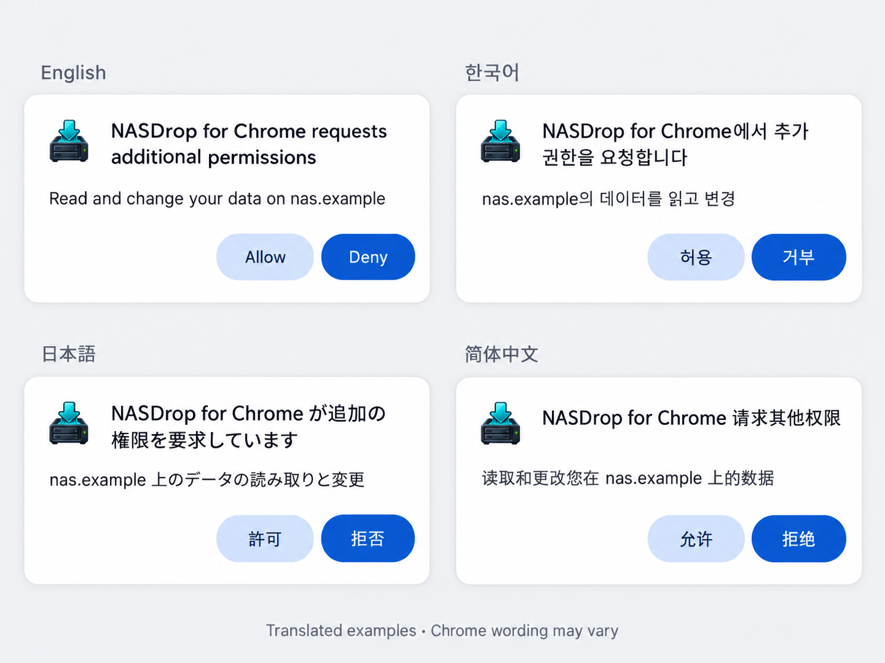

# First-login permission guide

[Installation guide (English)](README.md#install-locally) · [설치 안내 (한국어)](INSTALL.ko.md)

## English

On your first login after installing NASDrop for Chrome, Chrome may display an additional-permission dialog. **Click Allow, reopen the extension, and sign in again.**

1. Enter your NASDrop server address, username and password, then click **Connect** or press Enter in the password field.
2. If Chrome asks to read and change data on a site, confirm that the displayed address is your NASDrop server. Click **Allow** only for the intended server; otherwise click **Deny** and correct the address.
3. Click the NASDrop icon in Chrome's toolbar to reopen the extension.
4. Enter your credentials again if needed, then click **Connect** or press Enter. Permission approval alone does not complete login.
5. Confirm that the destination and job list appear. If login still fails, check the server address and credentials rather than repeatedly granting permissions.

The image is a translated illustration, not four captured Chrome dialogs. Wording and button labels may vary with Chrome version and language. `nas.example` is a placeholder, not an address to enter. Never bypass certificate warnings. This guide documents the reported first-login behavior; it does not change authentication or permission handling.

## 한국어

NASDrop for Chrome 설치 후 처음 로그인할 때 Chrome의 추가 권한 요청이 나타날 수 있습니다. **허용을 누른 다음 확장을 다시 열고 다시 로그인하세요.**

1. NASDrop 서버 주소, 아이디, 비밀번호를 입력하고 **연결**을 누르거나 비밀번호 칸에서 Enter를 누릅니다.
2. 사이트의 데이터를 읽고 변경할 권한을 요청하면 표시된 주소가 본인의 NASDrop 서버인지 확인합니다. 올바른 주소일 때만 **허용**을 누르세요. 다른 주소라면 **거부**하고 주소를 수정합니다.
3. Chrome 툴바의 NASDrop 아이콘을 눌러 확장을 다시 엽니다.
4. 필요하면 아이디와 비밀번호를 다시 입력한 뒤 **연결** 또는 Enter로 다시 로그인합니다. 권한 허용만으로 로그인이 완료되지는 않습니다.
5. 저장 위치와 작업 목록이 표시되는지 확인합니다. 계속 실패하면 반복해서 권한을 허용하기보다 서버 주소와 계정을 확인하세요.

이미지는 실제 네 언어 Chrome 화면을 촬영한 것이 아니라 번역한 설명용 예시입니다. Chrome 버전·언어에 따라 문구와 버튼명이 다를 수 있습니다. `nas.example`은 예시이며 실제 입력할 주소가 아닙니다. 인증서 경고를 우회하지 마세요. 이 안내는 보고된 첫 로그인 동작을 설명하며 인증·권한 처리 코드를 변경하지 않습니다.

## 日本語

NASDrop for Chrome をインストールして初めてログインすると、Chrome に追加の権限を求める画面が表示されることがあります。**「許可」をクリックした後、拡張機能を開き直して、もう一度ログインしてください。**

1. NASDrop サーバーのアドレス、ユーザー名、パスワードを入力し、接続ボタンをクリックするか、パスワード欄で Enter キーを押します。
2. サイトのデータの読み取りと変更を求められたら、表示されたアドレスが自分の NASDrop サーバーであることを確認します。正しい場合のみ「許可」をクリックしてください。違う場合は「拒否」を選び、アドレスを修正します。
3. Chrome のツールバーにある NASDrop アイコンをクリックして、拡張機能を開き直します。
4. 必要に応じてユーザー名とパスワードを再入力し、接続ボタンまたは Enter キーでもう一度ログインします。権限を許可しただけではログインは完了しません。
5. 保存先とジョブ一覧が表示されることを確認します。失敗が続く場合は、権限の許可を繰り返すのではなく、サーバーのアドレスとアカウント情報を確認してください。

画像は翻訳した説明用の例であり、4 言語の Chrome 画面を実際に撮影したものではありません。Chrome のバージョンや言語によって表記が異なる場合があります。`nas.example` は例示用で、入力するアドレスではありません。証明書の警告を無視しないでください。この案内は報告された初回ログインの動作を説明するもので、認証や権限処理のコードを変更するものではありません。

## 简体中文

安装 NASDrop for Chrome 后首次登录时，Chrome 可能会显示额外权限请求。**点击“允许”后，重新打开扩展程序并再次登录。**

1. 输入 NASDrop 服务器地址、用户名和密码，然后点击连接按钮，或在密码输入框中按 Enter 键。
2. 如果 Chrome 请求读取和更改网站数据，请确认显示的地址是您自己的 NASDrop 服务器。仅在地址正确时点击“允许”；否则点击“拒绝”并更正地址。
3. 点击 Chrome 工具栏上的 NASDrop 图标，重新打开扩展程序。
4. 如有需要，重新输入用户名和密码，然后点击连接按钮或按 Enter 键再次登录。授予权限并不代表登录已完成。
5. 确认保存位置和任务列表已显示。如果仍然无法登录，请检查服务器地址和账户信息，而不是反复授予权限。

图片是翻译后的说明示例，并非实际截取的四种语言的 Chrome 对话框。具体文字和按钮名称可能因 Chrome 版本及语言而异。`nas.example` 只是示例，并非应输入的地址。请勿绕过证书警告。本指南说明用户报告的首次登录行为，不会更改身份验证或权限处理代码。
